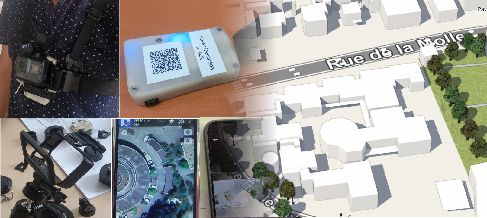

# Towards City Information Modeling



/ Image composite : terrain (Mapillary) => JNT /

Ce répertoire contient xxx

Il a été réalisé pendant mon stage de xxx mois au Cerema Med.

Pendant ce stage, j'ai xxx sur ces territoires xxx

Sur le territoire de xxx, j'ai xxx

Sur le territoire de xxx, j'ai xxx

/ Parler de la marchabilité, de l'accessibilité /

Auteur : Alaeddine JERAD ([compte OpenStreetMap](https://www.openstreetmap.org/user/Alaeddinejerad))

## 🔽 Installation

```
git clone https://github.com/CEREMA/CIM.git
cd CIM
python -m venv venv
venv\script\activate
pip install -r requirements.txt
```

## 📂 Contenu

```
open_data      # Données ouvertes, disponibles sur les portails, les APIs comme celle de Mapillary, OSM, etc
terrain_data   # Données terrain
terrain_photos # Echantillon de photos prises sur le terrain
notebooks      # Notebooks Python
qgis_projets   # Projets QGIS contenant les données, les styles et les cartes
qgis-scripts   # Scripts QGIS
livrables      # Livrables (rapport + projet blender)
```

## 💾 Données

### ☁ Organisation des données OpenData

**raw** pour les données brutes, processed **pour** les données de raw qui ont été retraitées

```
data_open                         # Données ouvertes, disponibles sur les portails
  raw                             # Données brutes
  processed                       # Données traitées
```

### 🥾 Organisation des données de terrain

Un dossier par sortie terrain

```
terrain_data                      
  raw
    Aix Faubourg                      # troisième sortie
    Lorgues                           # seconde sortie
    Pole d'activité d'aix en provence # première sortie
  processed
    Aix Faubourg
    Lorgues
    Pole d'activité d'aix en provence
```

## 📲 Matériel terrain utilisé


- GOPRO : xxx
- Récepteur Centipede type ROver RTK: xxx
- Smartphone avec le logiciel SWMaps + tests QField + test [Lefebure NTRIP Client](https://play.google.com/store/apps/details?id=com.lefebure.ntripclient&hl=fr)

## ⚙ Scripts QGIS

### Liste des scripts

```
Eclairage_bbox.py
Eclairage_DATASUD_bbox.py
Eclairage_mly_bbox.py
Eclairage_OSM_bbox.py
```

### ⚠ Prérequis

#### Création de compte Mapillary

Pour le script Eclairage_mly_bbox.py, il est nécessaire de créer un compte sur mapillary.

Mettre la clé API dans un fichier texte

Mapillary permet de récupérer sur une emprise territoriale :

- cette [liste d'objets points](https://www.mapillary.com/developer/api-documentation/points?locale=fr_FR)
- cette [liste d'objets traffic-sign](https://www.mapillary.com/developer/api-documentation/traffic-signs?locale=fr_FR)

Le script Eclairage_mly_bbox.py peut être adapté pour récupérer d'autres objets, pour d'autres thématiques.

#### Installation de librairies Python dans QGIS

Certains scripts QGIS nécessitent, pour fonctionner, d'installer certaines librairies python. Il s'agit en particulier du script faisant appel à Mapillary.

Voici comment installer une nouvelle librairie python dans QGIS sous Windows :

- Si par exemple, nous sommes sous QGIS 3.26, aller dans `C:\ProgramData\Microsoft\Windows\Start Menu\Programs\QGIS 3.26.0`
- Ouvrir **OSGeo4W Shell**
- Taper `pip install mercantile vt2geojson geopandas pandas`
- Ouvrir **QGIS**
- Aller dans `Extensions > Console Python`
- Taper `import mercantile` pour tester si la librairie existe
- Sinon, essayer https://www.youtube.com/watch?v=TPMHhgR-r7E ou https://landscapearchaeology.org/2018/installing-python-packages-in-qgis-3-for-windows/

### Utilisation

Pour utiliser un script dans QGIS, il faut :

xxx

## 🐍 Notebooks Python

Les notebooks ont servi à préparer les scripts QGIS. Ils sont dans le dossier **notebooks** :

| Notebook                                                     | Action                                                       | Mode d'action |
| ------------------------------------------------------------ | ------------------------------------------------------------ | ------------- |
| 02.1-Eclairage_datasud.ipynb                                 | Lampadaires de DataSud                                       | OpenData      |
| 02.2-Eclairage_OSM.ipynb                                     | Lampadaires d'OSM                                            | OpenData      |
| 02.3-Eclairage_Mapillary.ipynb                               | Lampadaires de Mapillary                                     | OpenData      |
| 02.4-Eclairage_Mapillary_Par_Routes_Lorgues.ipynb            | Lampadaires le long des rues de Lorgues                      | OpenData      |
| 02.4.a-Eclairage_Mapillary_Par_Routes--mr.ipynb              | Lampadaires le long des rues de Lorgues (version Mathieu)    | OpenData      |
| 02.5-Objets_Points_Mapillary_Par_Routes_Lorgues.ipynb        | Objets points Mapillary le long des rues de Lorgues          | OpenData      |
| 03-Education_OSM.ipynb                                       | Ecoles sur une étendue géographique donnée                   | OpenData      |
| 04.1-Points_Mapillary.ipynb                                  | Objets points Mapillary                                      | OpenData      |
| 04.2-Paneaux_signalisation_Mapillary.ipynb                   | Panneaux de signalisation depuis Mapillary                   | OpenData      |
| 05.1-arrets-de-transport-datagouv.ipynb                      | Arrêts de transport depuis DataGouv                          | OpenData      |
| 05.2-arrets-de-transport-datasud.ipynb                       | Arrêts de transport depuis DataSud                           | OpenData      |
| 05.3-arrets-de-transport-OSM.ipynb.ipynb                     | Arrêts de transport depuis OSM                               | OpenData      |
| 05.4-Arrêts-Transport-API-GTFS-DataGouv.ipynb                | Arrêts de transport depuis API GTFS Data Gouv fr             |               |
| 06-passage_piétons_OSM.ipynb                                 | Passages piétons depuis OSM                                  | OpenData      |
| 07.1-trottoirs_OSM.ipynb                                     | Trottoirs depuis OSM<br />`footway:sidewalk`                 | OpenData      |
| 07.2-Présence_trottoir_OSM.ipynb                             | Présence de trottoir<br />`sidewalk': ['both','left','right']` | OpenData      |
| 08-rue_piétonne_OSM.ipynb                                    | Rue piétonne depuis OSM<br />`'highway': 'pedestrian'`       | OpenData      |
| 09-Voie_en_zone_de_rencontre_OSM.ipynb                       | Voie en zone de rencontre<br />`'highway': 'living_street', 'maxspeed':'20'` | OpenData      |
| 10-Voie_en_zone_30_OSM.ipynb                                 | `'zone:maxspeed': 'FR:30','maxspeed': '30'`                  | OpenData      |
| 11-Voie_en_zone_40_OSM-Copy1.ipynb                           | `'zone:maxspeed': 'FR:40','maxspeed': '40'`                  | OpenData      |
| 12-Voie_en_zone_50_OSM.ipynb                                 | `'zone:maxspeed': 'FR:50','maxspeed': '50'`                  | OpenData      |
| 13.1-Recalage points Gopro.ipynb (expérimental)              | Expérience de recalage des points par plus proche voisin     | Terrain       |
| 13-Vérification recalage points Gopro.ipynb                  | Vérification du recalage photo réalisé par JOSM              | Terrain       |
| 14.1-Création de la trace GPX horodatée - Lorgues.ipynb      | Création d'une trace depuis les points trackpoints collectés depuis SWMaps pour Lorgues | Terrain       |
| 14.2-Création de la trace GPX horodatée - Pole d'activités.ipynb | Création d'une trace depuis les points trackpoints collectés depuis SWMaps pour le Pôle d'Activités | Terrain       |
| 14.3-Création de la trace GPX horodatée - Rover RTK et GoPro collés.ipynb | Création d'une trace depuis les points trackpoints collectés depuis SWMaps pour le Pôle d'Activités avec GoPro et RTK collés l'un à l'autre (vérification des interférences et qualité du signal) | Terrain       |
| 14.4-Création de la trace GPX horodatée - Rover RTK et GoPro séparés.ipynb | Création d'une trace depuis les points trackpoints collectés depuis SWMaps pour le Pôle d'Activités avec GoPro et RTK séparés l'un de l'autre (vérification des interférences et qualité du signal) | Terrain       |
| 16-Liste_des_objets_Point_Mapillary.ipynb                    | Liste les objets pouvant être détectés par Mapillary         | Terrain       |
| 17-Export-GPKG-Layers-For-JOSM--MR.ipynb                     | Exporte les différentes couches contenues dans un GPKG unique issu de SWMaps | Terrain       |
| 18-Données-OSM-Alaeddine                                     | Récupérer les données saisies par un utilisateur             | Terrain       |
| 19-Audit-Qualité-Données-Aix-Faubourg.ipynb                  | Précision des objets saisis et des zones de saisie           | Terrain       |
| 20-Largeur-Trottoirs.ipynb                                   | Récupération des trottoirs, calcul de la ligne médiane et de la largeur du trottoir | Terrain       |

Pour les ouvrir :

Ouvrir l'invite de commandes (cmd)

Puis, lancer jupyter dans le dossier notebooks

```
cd mondossiercim
venv\script\activate
jupyter notebook
```

## 🗺 Projets QGIS

xxx

## 🤖 Projet Blender

xxx

## 📷 Recalage des photos avec JOSM

Pour recaler des photos avec JOSM, il faut :

xxx

## Recalage des adresses sous OSM Id

xxx

## Livrables

- Rapport de stage
- Présentation pour Data & Co
- Bibliographie Zotero : https://www.zotero.org/groups/5458220/cim-dtermed/library
- Notebooks Python
- Scripts QGIS
- Non réalisé
  - Data Management Plan


## 📚 Ressources

### Vidéos utiles

- Comment créer un MNT, un MNS et un MNH depuis une donnée LIDAR comme Lidar HD.
- xxx

### OpenStreetMap

#### Surfaces

- [smoothness](https://wiki.openstreetmap.org/wiki/Key:smoothness)
  - good
  - bad
  - ...
- [surface](https://wiki.openstreetmap.org/wiki/Key:surface)

#### Arbres

- tree_row

### 🚶‍♀️ Trottoirs

#### OSM

- https://wiki.openstreetmap.org/wiki/Key:sidewalk
- https://wiki.openstreetmap.org/wiki/Key:width
- Cartographier les trottoirs
  - area:highway=footway
    - https://forum.openstreetmap.fr/t/les-trottoirs-sont-des-surfaces/21552/16
    - https://wiki.openstreetmap.org/wiki/Key:area:highway
    - https://wiki.openstreetmap.org/wiki/Tag%3Aarea%3Ahighway%3Dfootway
      - *This tag is not the same as `highway=footway` + `area=yes` which represents a non-linear feature such as a square or plaza where multi-directional travel is possible.*

    - https://wiki.openstreetmap.org/wiki/Talk:Tag:highway%3Dfootway#Mapping_footway_as_square_is_an_incorrect_tagging_for_renderer

- https://wiki.openstreetmap.org/wiki/Guidelines_for_pedestrian_navigation

#### opensidewalkmap

- https://wiki.openstreetmap.org/wiki/Opensidewalkmap
- opensidewalkmap https://x.com/asturksever/status/1802702457295818931/photo/1

#### walkabout

- walkabout https://tasks.mapwith.ai/projects/165
- https://www.youtube.com/watch?v=lb8mErptKM8&t=6s

#### Projets fr

- OSMontrouge https://data.osmontrouge.fr/explore/dataset/emprise-des-trottoirs/information/

#### OpenSideWalks

- https://tasks.opensidewalks.com/
- https://www.youtube.com/watch?v=mXp7fCL6CPw
- https://www.youtube.com/watch?v=_AczR5YHPdw

#### ShareStreets

- [https://sharedstreets.io/](https://github.com/sharedstreets)
- https://github.com/sharedstreets
- https://medium.com/sharedstreets/crossroads-for-the-curb-be3137154148

#### curblr

- https://curblr.org/
- https://www.azavea.com/blog/2020/07/07/maintaining-data-on-the-curb-with-curblr-a-new-open-standard/


### Applis mobiles OSM

https://thejeshgn.com/2022/06/10/linked-list-three-android-apps-to-efficiently-contribute-to-openstreetmap/

### Points d'accès aux données

- catalogue.data.gouv.fr
- API de découverte data.gouv.fr

### Services de calculs

- Isochrones IGN ou OSM

### Data Management Plan

- *Toolkit from EU Commission http://ec.europa.eu/research/participants/data/ref/h2020/gm/reporting/h2020-tpl-oa-data-mgt-plan_en.docx
- *Horizon https://ec.europa.eu/research/participants/data/ref/h2020/grants_manual/hi/oa_pilot/h2020-hi-oa-data-mgt_en.pdf
- Belmont
  - Formation https://bfe-inf.github.io/toolkit/index.html
  - Guide https://bfe-inf.github.io/toolkit/ddomp.html
- Good practices https://zenodo.org/records/1421739
- DMP Tool https://dmptool.org/public_plans
- Liste de DMPs https://dmponline.dcc.ac.uk/public_plans
- Exemples https://www.dcc.ac.uk/resources/data-management-plans/guidance-examples
- DZW Tool https://ds-wizard.org/
- Data model plan : https://bu.univ-amu.libguides.com/donneesrecherche/PGD-DMP https://doranum.fr/wp-content/uploads/FicheSynthDMP.pdf

#### BPMN

Business Processing Model Notation (BPMN) : https://en.wikipedia.org/wiki/Business_process_modeling
